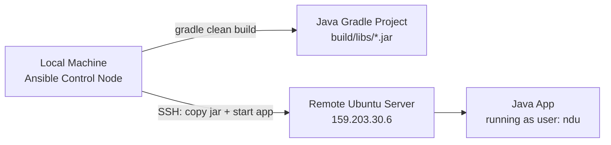
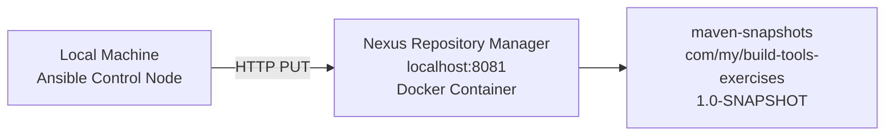

# Ansible Pipeline Automation

This project contains solutions to the Ansible module exercises of the DevOps bootcamp.

---

## Exercise 1: Build & Deploy Java Artifact

Builds a Java Gradle application locally and deploys the jar to a remote Ubuntu server. Creates a Linux user on the remote server if it doesn't exist. On re-runs, stops the running app and removes the old jar before deploying the new one.

### Architecture



### Configuration

**`ansible.cfg`** — disables SSH host key checking, sets default inventory to `hosts`.

**`hosts`** — defines the `web_server` group pointing to the remote server with SSH key and user.

### Prerequisites

On the remote server, install the `acl` package:
```bash
sudo apt-get update -y && sudo apt-get install -y acl
```

Verify Ansible connectivity:
```bash
ansible -i hosts web_server -m ping
```

### Execution

```bash
ansible-playbook -i hosts 1-build-and-deploy.yaml \
  --extra-vars "linux_user=ndu \
  project_dir=/home/ndu/DevOps-Project/Build-Tools/Java-Build-Tools-Project \
  jar_name=build-tools-exercises-1.0-SNAPSHOT.jar"
```

### What the Playbook Does

1. Creates Linux user on the remote server
2. Installs Java 17 on the remote server
3. Builds the jar locally with `gradle clean build`
4. Stops the running app and removes the old jar (skipped on first run)
5. Copies the new jar, starts the app, and verifies it is running

### Verify Deployment

SSH into the server and check the running process:

```bash
ssh root@159.203.30.6
ps aux | grep java
```

Output:
```
ndu   4348  1.4  6.2 2602804 125308 ?  Sl  03:37  0:09 java -jar build-tools-exercises-1.0-SNAPSHOT.jar &
```

The application is running as user `ndu` on the remote server.

---

## Exercise 2: Push Java Artifact to Nexus

Pushes a locally built jar artifact to a Nexus Repository Manager `maven-snapshots` repository using an HTTP PUT request. The playbook runs entirely on localhost — no remote server required.

### Architecture



### Prerequisites

Nexus running as a Docker container:
```bash
docker run -d -p 8081:8081 --name nexus sonatype/nexus3
```

Get the initial admin password:
```bash
docker exec nexus cat /nexus-data/admin.password
```

Log in at `http://localhost:8081`, complete the setup wizard, and confirm the `maven-snapshots` repository exists under **Browse**.

### Execution

```bash
ansible-playbook -i hosts 2-push-to-nexus.yaml \
  --extra-vars "nexus_url=http://localhost:8081 \
  nexus_user=admin \
  nexus_password=<your-password> \
  repository_name=maven-snapshots \
  artifact_name=build-tools-exercises \
  artifact_version=1.0-SNAPSHOT \
  jar_file_path=/home/ndu/DevOps-Project/Build-Tools/Java-Build-Tools-Project/build/libs/build-tools-exercises-1.0-SNAPSHOT.jar"
```

### What the Playbook Does

1. Authenticates to Nexus using basic auth
2. Uploads the jar via HTTP PUT to `maven-snapshots` under path `com/my/build-tools-exercises/1.0-SNAPSHOT/`
3. Returns HTTP 201 on success

### Verify Deployment

Browse to **Nexus → Browse → maven-snapshots** and confirm the artifact is present.


