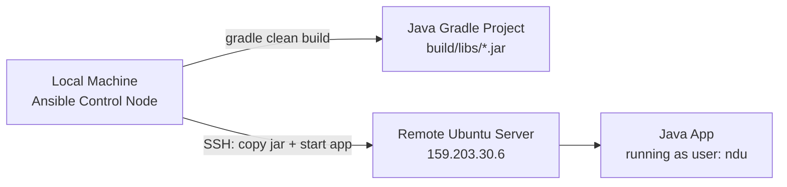
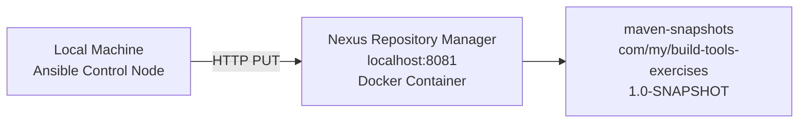
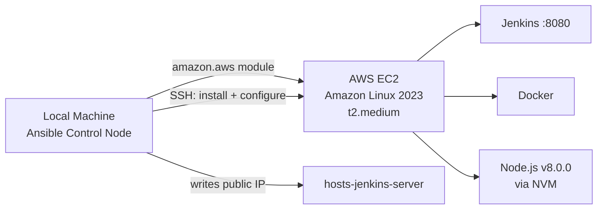
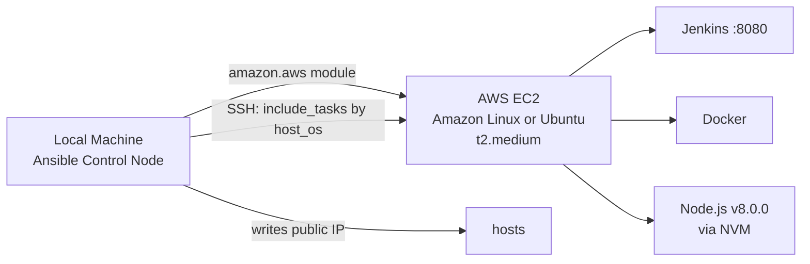
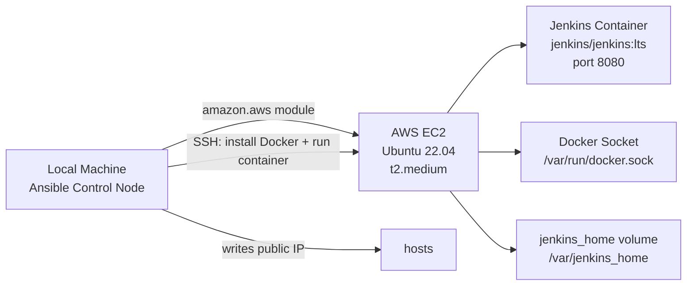
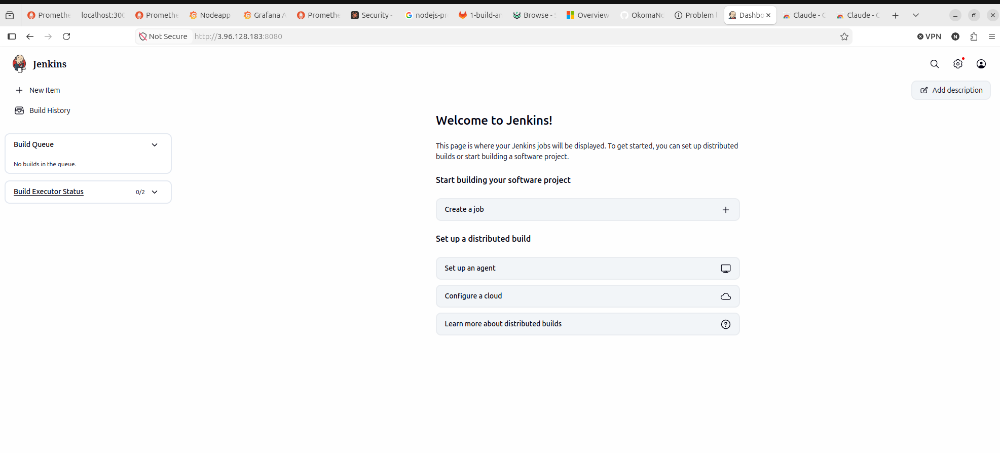
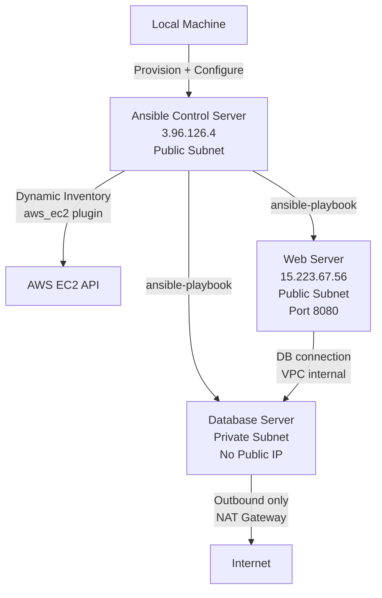

# Ansible Pipeline Automation

This project contains solutions to the Ansible module exercises of the DevOps bootcamp.

---

## Exercise 1: Build & Deploy Java Artifact

Builds a Java Gradle application locally and deploys the jar to a remote Ubuntu server. Creates a Linux user on the remote server if it doesn't exist. On re-runs, stops the running app and removes the old jar before deploying the new one.

### Why This Matters

Manual deployments are error-prone and time-consuming. This exercise demonstrates how Ansible eliminates manual SSH steps by automating the full build-to-deploy lifecycle — building the artifact, transferring it, and managing the running process — all from a single command. This is the foundation of any CI/CD pipeline: consistent, repeatable, and human-error-free deployments.

### Architecture



### Configuration

**`ansible.cfg`** — disables SSH host key checking, sets default inventory to `hosts`.

**`hosts`** — defines the `web_server` group pointing to the remote server with SSH key and user.

### Prerequisites

On the remote server, install the `acl` package:
```bash
sudo apt-get update -y && sudo apt-get install -y acl
```

Verify Ansible connectivity:
```bash
ansible -i hosts web_server -m ping
```

### Execution

```bash
ansible-playbook -i hosts 1-build-and-deploy.yaml \
  --extra-vars "linux_user=ndu \
  project_dir=/home/ndu/DevOps-Project/Build-Tools/Java-Build-Tools-Project \
  jar_name=build-tools-exercises-1.0-SNAPSHOT.jar"
```

### What the Playbook Does

1. Creates Linux user on the remote server
2. Installs Java 17 on the remote server
3. Builds the jar locally with `gradle clean build`
4. Stops the running app and removes the old jar (skipped on first run)
5. Copies the new jar, starts the app, and verifies it is running

### Verify Deployment

SSH into the server and check the running process:

```bash
ssh root@159.203.30.6
ps aux | grep java
```

Output:
```
ndu   4348  1.4  6.2 2602804 125308 ?  Sl  03:37  0:09 java -jar build-tools-exercises-1.0-SNAPSHOT.jar &
```

The application is running as user `ndu` on the remote server.

---

## Exercise 2: Push Java Artifact to Nexus

Pushes a locally built jar artifact to a Nexus Repository Manager `maven-snapshots` repository using an HTTP PUT request. The playbook runs entirely on localhost — no remote server required.

### Why This Matters

Storing build artifacts in a central repository manager is a core DevOps practice. It ensures every version of your software is versioned, traceable, and available for downstream deployments without needing to rebuild from source. This exercise demonstrates how Ansible can integrate with artifact management systems like Nexus, making artifact publishing a repeatable automated step rather than a manual upload.

### Architecture



### Prerequisites

Nexus running as a Docker container:
```bash
docker run -d -p 8081:8081 --name nexus sonatype/nexus3
```

Get the initial admin password:
```bash
docker exec nexus cat /nexus-data/admin.password
```

Log in at `http://localhost:8081`, complete the setup wizard, and confirm the `maven-snapshots` repository exists under **Browse**.

### Execution

```bash
ansible-playbook -i hosts 2-push-to-nexus.yaml \
  --extra-vars "nexus_url=http://localhost:8081 \
  nexus_user=admin \
  nexus_password=<your-password> \
  repository_name=maven-snapshots \
  artifact_name=build-tools-exercises \
  artifact_version=1.0-SNAPSHOT \
  jar_file_path=/home/ndu/DevOps-Project/Build-Tools/Java-Build-Tools-Project/build/libs/build-tools-exercises-1.0-SNAPSHOT.jar"
```

### What the Playbook Does

1. Authenticates to Nexus using basic auth
2. Uploads the jar via HTTP PUT to `maven-snapshots` under path `com/my/build-tools-exercises/1.0-SNAPSHOT/`
3. Returns HTTP 201 on success

### Verify Deployment

Browse to **Nexus → Browse → maven-snapshots** and confirm the artifact is present.


---

## Exercise 3: Install Jenkins on EC2 (Amazon Linux)

Provisions an Amazon Linux EC2 instance on AWS and installs Jenkins, Docker, and Node.js on it using two separate playbooks — one for provisioning the server and one for configuring it.

### Why This Matters

Manually spinning up cloud servers and configuring them is slow, inconsistent, and impossible to scale. This exercise demonstrates infrastructure as code — using Ansible to dynamically provision an EC2 instance and configure it into a fully working CI server in a single automated workflow. This removes the dependency on manual AWS console clicks and guarantees the same environment is reproduced every time.

### Architecture



### Prerequisites

- AWS credentials configured: `aws configure`
- Python boto3 installed: `sudo apt install python3-boto3`
- Ansible AWS collection: `ansible-galaxy collection install amazon.aws`
- EC2 key pair created and `.pem` file available locally
- `hosts-jenkins-server` file created: `touch hosts-jenkins-server`
- Port 8080 open in AWS Security Group

### Step 1 — Provision EC2 Instance

```bash
ansible-playbook 3-provision-jenkins-ec2.yaml \
  --extra-vars "ssh_key_path=/home/ndu/Downloads/ansible.pem \
  aws_region=ca-central-1 \
  key_name=ansible \
  subnet_id=subnet-0012ce5d3a6028493 \
  ami_id=ami-0495a76ecf381a767 \
  ssh_user=ec2-user"
```

This will:
1. Query VPC information in the specified region
2. Create an EC2 `t2.medium` instance tagged `jenkins-server` with a public IP
3. Wait 60 seconds for the public IP to be assigned
4. Write the public IP into `hosts-jenkins-server`

### Step 2 — Install and Configure Jenkins

Wait 2-3 minutes for the instance to fully boot, then run:

```bash
ansible-playbook -i hosts-jenkins-server 3-install-jenkins-ec2.yaml \
  --extra-vars "aws_region=ca-central-1"
```

This will:
1. Install Java 21 (Amazon Corretto) and set it as default
2. Add Jenkins repository and install Jenkins
3. Install Docker
4. Install Node.js v8.0.0 via NVM
5. Start Jenkins and print the initial admin password

### What the Playbook Does

| Play | Action |
|------|--------|
| Get server IP | Queries AWS for the `jenkins-server` public IP |
| Prepare server | Installs Java 21, Jenkins, Docker, Node.js |
| Start Jenkins | Starts Jenkins service, verifies port 8080, prints admin password |

### Verify Deployment

Access Jenkins in browser:
```
http://<ec2-public-ip>:8080
```

Get the admin password from playbook output (base64 encoded) and decode it:
```bash
echo "<base64-password>" | base64 --decode
```

**Actual run output:**
```
Jenkins listening on port 8080
Admin password: <redacted>
EC2 Public IP: <redacted>
```


---

## Exercise 4: Install Jenkins on Ubuntu (Multi-OS Support)

Extends the Jenkins provisioning to support both Amazon Linux and Ubuntu servers using a single playbook with `include_tasks` and `when` conditionals. OS-specific installation steps are split into separate task files.

### Why This Matters

Real-world infrastructure is rarely homogeneous — teams run a mix of operating systems across cloud providers, on-premise servers, and legacy environments. Hardcoding OS-specific logic into separate playbooks creates duplication and maintenance overhead. This exercise shows how to write a single, flexible playbook that adapts to the target environment at runtime using conditionals, making your automation portable and easier to maintain as infrastructure grows.

### Architecture



### Files

| File | Purpose |
|------|---------|
| `3-provision-jenkins-ec2.yaml` | Provisions EC2 and writes IP to `hosts` under `[jenkins_server]` |
| `4-install-jenkins-ubuntu.yaml` | Main playbook — queries EC2 IP, conditionally includes OS tasks, starts Jenkins |
| `4-host-ubuntu.yaml` | Ubuntu-specific tasks: apt, OpenJDK 21, Jenkins GPG key, Docker |
| `4-host-amazon.yaml` | Amazon Linux-specific tasks: yum, Amazon Corretto, Jenkins repo, Docker |

### Prerequisites

- All Exercise 3 prerequisites apply
- `hosts` file must have a `[jenkins_server]` group
- Port 8080 open in Security Group / firewall

### Step 1 — Provision EC2 Instance

**Ubuntu:**
```bash
ansible-playbook 3-provision-jenkins-ec2.yaml \
  --extra-vars "ssh_key_path=/home/ndu/Downloads/ansible.pem \
  aws_region=ca-central-1 \
  key_name=ansible \
  subnet_id=subnet-0012ce5d3a6028493 \
  ami_id=ami-073095b1f097db96d \
  ssh_user=ubuntu"
```

**Amazon Linux:**
```bash
ansible-playbook 3-provision-jenkins-ec2.yaml \
  --extra-vars "ssh_key_path=/home/ndu/Downloads/ansible.pem \
  aws_region=ca-central-1 \
  key_name=ansible \
  subnet_id=subnet-0012ce5d3a6028493 \
  ami_id=ami-0495a76ecf381a767 \
  ssh_user=ec2-user"
```

### Step 2 — Install and Configure Jenkins

Wait 2–3 minutes for the instance to fully boot, then run:

**Ubuntu:**
```bash
ansible-playbook -i hosts 4-install-jenkins-ubuntu.yaml \
  --extra-vars "host_os=ubuntu aws_region=ca-central-1"
```

**Amazon Linux:**
```bash
ansible-playbook -i hosts 4-install-jenkins-ubuntu.yaml \
  --extra-vars "host_os=amazon-linux aws_region=ca-central-1"
```

### What the Playbook Does

| Play | Action |
|------|--------|
| Get server IP | Queries AWS for the running `jenkins-server` public IP |
| Prepare server | Conditionally includes `4-host-ubuntu.yaml` or `4-host-amazon.yaml` based on `host_os` |
| Ubuntu tasks | Updates apt, installs OpenJDK 21, sets Java 21 as default, imports Jenkins GPG key, installs Jenkins and Docker |
| Amazon Linux tasks | Installs Amazon Corretto 17, adds Jenkins yum repo, installs Jenkins and Docker |
| Both | Installs Node.js v8.0.0 via NVM |
| Start Jenkins | Starts Jenkins service, verifies port 8080, prints base64-encoded admin password |

### Verify Deployment

Access Jenkins in browser:
```
http://<server-public-ip>:8080
```

Decode the base64 admin password from playbook output:
```bash
echo "<base64-password>" | base64 --decode
```

**Actual run output (Ubuntu):**
```
Jenkins listening on port 8080 (tcp6 :::8080)
Admin password (decoded): <redacted>
```


---

## Exercise 5: Install Jenkins as a Docker Container

Runs Jenkins as a Docker container on an Ubuntu EC2 instance, with volumes that mount the Docker socket and binary into the container so Jenkins can execute Docker commands inside its pipelines.

### Why This Matters

Running Jenkins as a Docker container is the modern, preferred approach over installing it directly on the OS. Containers are portable, isolated, and easy to replace — if Jenkins breaks, you restart the container rather than troubleshooting a system-level installation. Mounting the Docker socket into the container lets Jenkins build and push Docker images as part of CI pipelines, which is the foundation of container-based CI/CD workflows. This exercise demonstrates how Ansible can manage Docker containers on remote servers using the `community.docker` collection.

### Architecture



### Files

| File | Purpose |
|------|---------|
| `3-provision-jenkins-ec2.yaml` | Provisions Ubuntu EC2 and writes IP to `hosts` under `[jenkins_server]` |
| `5-install-jenkins-docker.yaml` | Installs Docker, starts Jenkins container with volumes, sets socket permissions |

### How the Ansible Playbook Works

`5-install-jenkins-docker.yaml` runs four plays in sequence:

| Play | Action |
|------|--------|
| Get server IP | Queries AWS for the running `jenkins-server` public IP using `amazon.aws.ec2_instance_info` |
| Prepare server | Installs `docker.io`, `python3-pip`, `python3-docker` via apt; starts Docker with `systemd` |
| Start Jenkins container | Finds Docker binary with `which docker`; starts `jenkins/jenkins:lts` container using `community.docker.docker_container` with socket, binary, and data volumes |
| Set Docker permission | Sets `/var/run/docker.sock` to mode `666` so the Jenkins container user can run Docker commands |

### Step 1 — Provision Ubuntu EC2 Instance

```bash
ansible-playbook 3-provision-jenkins-ec2.yaml \
  --extra-vars "ssh_key_path=/home/ndu/Downloads/ansible.pem \
  aws_region=ca-central-1 \
  key_name=ansible \
  subnet_id=subnet-0012ce5d3a6028493 \
  ami_id=ami-073095b1f097db96d \
  ssh_user=ubuntu"
```

### Step 2 — Confirm Instance is Ready

```bash
ssh -i /home/ndu/Downloads/ansible.pem ubuntu@<ec2-public-ip> "echo ready"
```

### Step 3 — Install Docker and Start Jenkins Container

```bash
ansible-playbook -i hosts 5-install-jenkins-docker.yaml \
  --extra-vars "aws_region=ca-central-1"
```

### Step 4 — Get Jenkins Admin Password

SSH into the server and retrieve the password from inside the container:

```bash
ssh -i /home/ndu/Downloads/ansible.pem ubuntu@<ec2-public-ip>
sudo docker exec jenkins cat /var/jenkins_home/secrets/initialAdminPassword
```

No base64 decoding needed — the password is printed as plain text.

### Verify Deployment

Access Jenkins in browser:
```
http://<ec2-public-ip>:8080
```

Verify the Jenkins container is running on the server:
```bash
sudo docker ps
```



---

## Exercise 6: Web Server and Database Server Configuration

Provisions a dedicated Ansible control plane server on AWS, then uses it to provision and configure a Java web application on a public web server connected to a private MySQL database server — all within the same VPC. The database server has no public IP and can only be reached through the NAT gateway for outbound traffic.

### Why This Matters

Production systems never expose databases directly to the internet. This exercise demonstrates the correct network architecture separation: a public-facing web tier and a private, inaccessible database tier communicating only over an internal VPC network. Using a dedicated Ansible control server reflects real-world practices where automation is driven from a hardened, internal machine — not a developer's laptop. Dynamic inventory eliminates the need to hardcode IPs, making the automation resilient to server restarts and IP changes.

### Architecture



### AWS Infrastructure

| Server | Subnet | Public IP | Key Pair |
|---|---|---|---|
| ansible-server | Public (`subnet-0012ce5d3a6028493`) | `3.96.126.4` | `ansible-control-server-key` |
| web-server | Public (`subnet-0012ce5d3a6028493`) | `15.223.67.56` | `ansible-managed-server-key` |
| database-server | Private (`subnet-0b9be228629f479d3`) | None | `ansible-managed-server-key` |

### Files

| File | Purpose |
|---|---|
| `6-provision-ansible-server.yaml` | Provisions the Ansible control plane EC2 instance |
| `6-configure-ansible-server.yaml` | Installs Ansible, copies keys, playbooks, AWS credentials, and Java JAR |
| `6-provision-app-servers.yaml` | Provisions web-server (public) and database-server (private) |
| `6-configure-app-servers.yaml` | Installs MySQL on DB server; deploys Java app on web server |
| `6-inventory_aws_ec2.yaml` | Dynamic inventory using `aws_ec2` plugin for `ca-central-1` |
| `6-vars.yaml` | MySQL configuration: root password, database name, user credentials |

### Pre-requisites

#### 1. Create AWS Key Pairs
In **EC2 → Key Pairs**, create two key pairs and download the `.pem` files:
```bash
chmod 400 ~/Downloads/ansible-control-server-key.pem
chmod 400 ~/Downloads/ansible-managed-server-key.pem
```

#### 2. Set Up NAT Gateway for Private Subnet
In **VPC Console**:
- Create a NAT gateway (`my-nat`) in the public subnet with an Elastic IP
- Create a route table (`my-db-rt`) with route `0.0.0.0/0 → my-nat`
- Associate `my-db-rt` with the private subnet (`subnet-0b9be228629f479d3`)

#### 3. Update Dynamic Inventory Region
`6-inventory_aws_ec2.yaml`:
```yaml
plugin: aws_ec2
regions:
- ca-central-1
keyed_groups:
- key: tags
  prefix: tag
```

#### 4. Uncomment Exercise 6 Lines in `ansible.cfg`
```ini
[defaults]
host_key_checking = False
inventory = hosts
enable_plugins = amazon.aws.aws_ec2
remote_user = ubuntu
private_key_file = /home/ubuntu/ansible-managed-server-key.pem
```

#### 5. Build the Java JAR Locally
```bash
cd ~/DevOps-Project/Docker/Java-Docker-Project
gradle build
# Output: build/libs/docker-exercises-project-1.0-SNAPSHOT.jar
```

---

### Phase 1 — From Local Machine

#### Step 1 — Provision the Ansible Control Server

```bash
cd ~/DevOps-Project/Configuration-Management-with-Ansible/ansible-pipeline-automation

ansible-playbook 6-provision-ansible-server.yaml \
  --extra-vars "aws_region=ca-central-1 \
  subnet_id=subnet-0012ce5d3a6028493 \
  ami_id=ami-073095b1f097db96d"
```

Creates a `t2.micro` Ubuntu EC2 instance tagged `ansible-server` with a public IP using `ansible-control-server-key`.

#### Step 2 — Verify Ansible Server is Ready

```bash
ssh -i ~/Downloads/ansible-control-server-key.pem ubuntu@3.96.126.4 "echo ready"
```

#### Step 3 — Configure the Ansible Control Server

```bash
ansible-playbook -i 6-inventory_aws_ec2.yaml 6-configure-ansible-server.yaml
```

This installs on the ansible-server:
- `ansible` and `python3-boto3` (via apt, then upgraded via pip to `ansible-core 2.17+`)
- `geerlingguy.mysql` Ansible Galaxy role
- `amazon.aws` Ansible collection
- AWS credentials (`~/.aws/credentials`)
- Both `.pem` key files from `~/Downloads/ansible-*.pem`
- All `6-*.yaml` playbooks and `ansible.cfg`
- Java JAR (`docker-exercises-project-1.0-SNAPSHOT.jar`)

> **Note:** After apt install, Ansible on Ubuntu 22.04 is version `2.10.8` which is incompatible with newer `amazon.aws` collections. Upgrade on the ansible-server:
> ```bash
> sudo apt-get install -y python3-pip
> pip3 install ansible --upgrade
> # Verify: ansible --version → ansible [core 2.17.x]
> ```

---

### Phase 2 — From the Ansible Control Server

SSH into the ansible-server:
```bash
ssh -i ~/Downloads/ansible-control-server-key.pem ubuntu@3.96.126.4
```

#### Step 4 — Provision Web Server and Database Server

```bash
ansible-playbook 6-provision-app-servers.yaml \
  --extra-vars "aws_region=ca-central-1 \
  key_name=ansible-managed-server-key \
  subnet_id_web=subnet-0012ce5d3a6028493 \
  subnet_id_db=subnet-0b9be228629f479d3 \
  ami_id=ami-073095b1f097db96d"
```

Creates:
- `database-server` — `t2.micro`, no public IP, in private subnet, tagged `server: database`
- `web-server` — `t2.micro`, public IP, in public subnet, tagged `server: web`

#### Step 5 — Wait 2–3 Minutes for Both Servers to Boot

#### Step 6 — Configure Both Servers

```bash
ansible-playbook -i 6-inventory_aws_ec2.yaml 6-configure-app-servers.yaml
```

**On `tag_Name_database_server` (database-server):**
- Installs MySQL via `geerlingguy.mysql` role using settings from `6-vars.yaml`
- Creates database `my-app-db` with `latin1` encoding
- Creates user `my-user` with full privileges on `my-app-db`
- Validates MySQL is running: `ps aux | grep mysql`

**On `tag_Name_web_server` (web-server):**
- Installs `openjdk-17-jdk`
- Copies JAR from ansible-server (`/home/ubuntu/docker-exercises-project-1.0-SNAPSHOT.jar`)
- Starts the Java app with DB environment variables pointing to the private IP of the database server:
  ```
  DB_USER=my-user
  DB_PWD=my-pass
  DB_SERVER=<private-ip-of-database-server>
  DB_NAME=my-app-db
  ```
- Validates Java process is running: `ps aux | grep java`

---

### Verify Deployment

Open port `8080` in the web server's security group (Custom TCP, source `0.0.0.0/0`), then access:

```
http://15.223.67.56:8080
```

**EC2 Instances — All three servers running:**


**Java Web Application — Connected to MySQL database:**


The "Team member roles" page confirms the Java application on the web server is successfully reading data from the MySQL database server running in the private subnet.

---

### Inspecting the Servers

**Ansible control server:**
```bash
ssh -i ~/Downloads/ansible-control-server-key.pem ubuntu@3.96.126.4
ls ~/                          # verify all files were copied
ansible --version              # verify ansible-core 2.17+
cat ~/.aws/credentials         # verify AWS credentials
```

**Web server:**
```bash
ssh -i ~/Downloads/ansible-managed-server-key.pem ubuntu@15.223.67.56
ps aux | grep java             # verify Java app is running
java -version                  # verify Java 17
```

**Database server** (SSH via ansible-server as bastion):
```bash
# From the ansible-server:
ssh -i ~/ansible-managed-server-key.pem ubuntu@<database-server-private-ip>
sudo mysql -u root             # verify MySQL is running
SHOW DATABASES;                # verify my-app-db exists
SELECT User, Host FROM mysql.user;  # verify my-user exists
```
