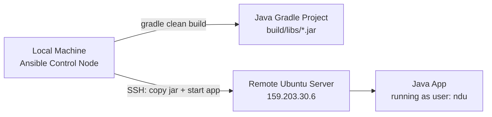
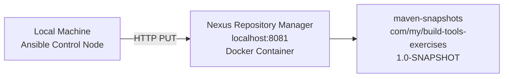
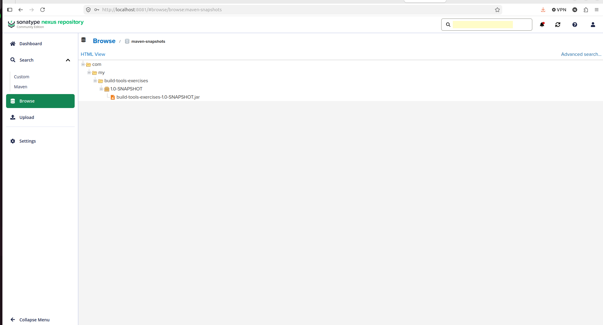
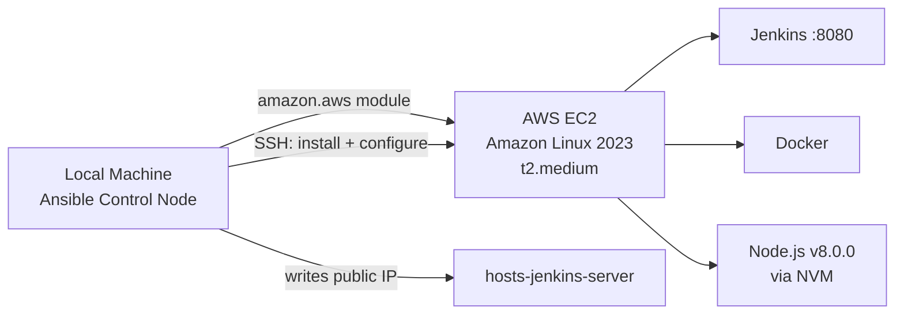
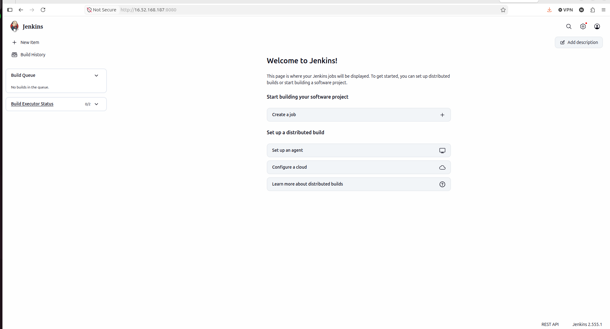
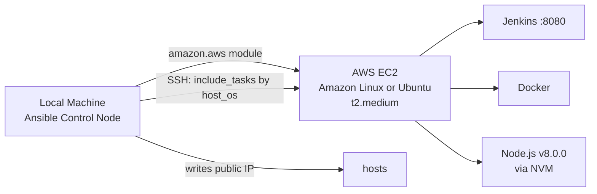
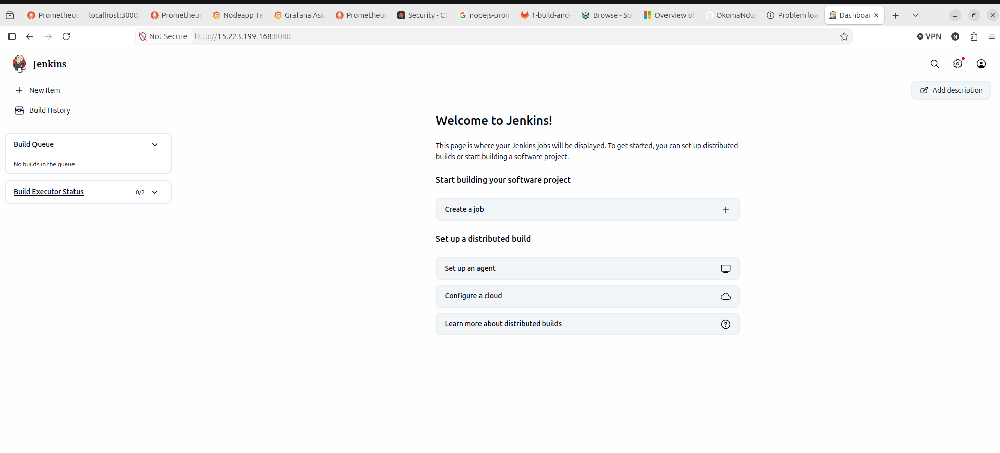

# Ansible Pipeline Automation

This project contains solutions to the Ansible module exercises of the DevOps bootcamp.

---

## Exercise 1: Build & Deploy Java Artifact

Builds a Java Gradle application locally and deploys the jar to a remote Ubuntu server. Creates a Linux user on the remote server if it doesn't exist. On re-runs, stops the running app and removes the old jar before deploying the new one.

### Why This Matters

Manual deployments are error-prone and time-consuming. This exercise demonstrates how Ansible eliminates manual SSH steps by automating the full build-to-deploy lifecycle — building the artifact, transferring it, and managing the running process — all from a single command. This is the foundation of any CI/CD pipeline: consistent, repeatable, and human-error-free deployments.

### Architecture



### Configuration

**`ansible.cfg`** — disables SSH host key checking, sets default inventory to `hosts`.

**`hosts`** — defines the `web_server` group pointing to the remote server with SSH key and user.

### Prerequisites

On the remote server, install the `acl` package:
```bash
sudo apt-get update -y && sudo apt-get install -y acl
```

Verify Ansible connectivity:
```bash
ansible -i hosts web_server -m ping
```

### Execution

```bash
ansible-playbook -i hosts 1-build-and-deploy.yaml \
  --extra-vars "linux_user=ndu \
  project_dir=/home/ndu/DevOps-Project/Build-Tools/Java-Build-Tools-Project \
  jar_name=build-tools-exercises-1.0-SNAPSHOT.jar"
```

### What the Playbook Does

1. Creates Linux user on the remote server
2. Installs Java 17 on the remote server
3. Builds the jar locally with `gradle clean build`
4. Stops the running app and removes the old jar (skipped on first run)
5. Copies the new jar, starts the app, and verifies it is running

### Verify Deployment

SSH into the server and check the running process:

```bash
ssh root@159.203.30.6
ps aux | grep java
```

Output:
```
ndu   4348  1.4  6.2 2602804 125308 ?  Sl  03:37  0:09 java -jar build-tools-exercises-1.0-SNAPSHOT.jar &
```

The application is running as user `ndu` on the remote server.

---

## Exercise 2: Push Java Artifact to Nexus

Pushes a locally built jar artifact to a Nexus Repository Manager `maven-snapshots` repository using an HTTP PUT request. The playbook runs entirely on localhost — no remote server required.

### Why This Matters

Storing build artifacts in a central repository manager is a core DevOps practice. It ensures every version of your software is versioned, traceable, and available for downstream deployments without needing to rebuild from source. This exercise demonstrates how Ansible can integrate with artifact management systems like Nexus, making artifact publishing a repeatable automated step rather than a manual upload.

### Architecture



### Prerequisites

Nexus running as a Docker container:
```bash
docker run -d -p 8081:8081 --name nexus sonatype/nexus3
```

Get the initial admin password:
```bash
docker exec nexus cat /nexus-data/admin.password
```

Log in at `http://localhost:8081`, complete the setup wizard, and confirm the `maven-snapshots` repository exists under **Browse**.

### Execution

```bash
ansible-playbook -i hosts 2-push-to-nexus.yaml \
  --extra-vars "nexus_url=http://localhost:8081 \
  nexus_user=admin \
  nexus_password=<your-password> \
  repository_name=maven-snapshots \
  artifact_name=build-tools-exercises \
  artifact_version=1.0-SNAPSHOT \
  jar_file_path=/home/ndu/DevOps-Project/Build-Tools/Java-Build-Tools-Project/build/libs/build-tools-exercises-1.0-SNAPSHOT.jar"
```

### What the Playbook Does

1. Authenticates to Nexus using basic auth
2. Uploads the jar via HTTP PUT to `maven-snapshots` under path `com/my/build-tools-exercises/1.0-SNAPSHOT/`
3. Returns HTTP 201 on success

### Verify Deployment

Browse to **Nexus → Browse → maven-snapshots** and confirm the artifact is present.



---

## Exercise 3: Install Jenkins on EC2 (Amazon Linux)

Provisions an Amazon Linux EC2 instance on AWS and installs Jenkins, Docker, and Node.js on it using two separate playbooks — one for provisioning the server and one for configuring it.

### Why This Matters

Manually spinning up cloud servers and configuring them is slow, inconsistent, and impossible to scale. This exercise demonstrates infrastructure as code — using Ansible to dynamically provision an EC2 instance and configure it into a fully working CI server in a single automated workflow. This removes the dependency on manual AWS console clicks and guarantees the same environment is reproduced every time.

### Architecture



### Prerequisites

- AWS credentials configured: `aws configure`
- Python boto3 installed: `sudo apt install python3-boto3`
- Ansible AWS collection: `ansible-galaxy collection install amazon.aws`
- EC2 key pair created and `.pem` file available locally
- `hosts-jenkins-server` file created: `touch hosts-jenkins-server`
- Port 8080 open in AWS Security Group

### Step 1 — Provision EC2 Instance

```bash
ansible-playbook 3-provision-jenkins-ec2.yaml \
  --extra-vars "ssh_key_path=/home/ndu/Downloads/ansible.pem \
  aws_region=ca-central-1 \
  key_name=ansible \
  subnet_id=subnet-0012ce5d3a6028493 \
  ami_id=ami-0495a76ecf381a767 \
  ssh_user=ec2-user"
```

This will:
1. Query VPC information in the specified region
2. Create an EC2 `t2.medium` instance tagged `jenkins-server` with a public IP
3. Wait 60 seconds for the public IP to be assigned
4. Write the public IP into `hosts-jenkins-server`

### Step 2 — Install and Configure Jenkins

Wait 2-3 minutes for the instance to fully boot, then run:

```bash
ansible-playbook -i hosts-jenkins-server 3-install-jenkins-ec2.yaml \
  --extra-vars "aws_region=ca-central-1"
```

This will:
1. Install Java 21 (Amazon Corretto) and set it as default
2. Add Jenkins repository and install Jenkins
3. Install Docker
4. Install Node.js v8.0.0 via NVM
5. Start Jenkins and print the initial admin password

### What the Playbook Does

| Play | Action |
|------|--------|
| Get server IP | Queries AWS for the `jenkins-server` public IP |
| Prepare server | Installs Java 21, Jenkins, Docker, Node.js |
| Start Jenkins | Starts Jenkins service, verifies port 8080, prints admin password |

### Verify Deployment

Access Jenkins in browser:
```
http://<ec2-public-ip>:8080
```

Get the admin password from playbook output (base64 encoded) and decode it:
```bash
echo "<base64-password>" | base64 --decode
```

**Actual run output:**
```
Jenkins listening on port 8080
Admin password: <redacted>
EC2 Public IP: <redacted>
```



---

## Exercise 4: Install Jenkins on Ubuntu (Multi-OS Support)

Extends the Jenkins provisioning to support both Amazon Linux and Ubuntu servers using a single playbook with `include_tasks` and `when` conditionals. OS-specific installation steps are split into separate task files.

### Why This Matters

Real-world infrastructure is rarely homogeneous — teams run a mix of operating systems across cloud providers, on-premise servers, and legacy environments. Hardcoding OS-specific logic into separate playbooks creates duplication and maintenance overhead. This exercise shows how to write a single, flexible playbook that adapts to the target environment at runtime using conditionals, making your automation portable and easier to maintain as infrastructure grows.

### Architecture



### Files

| File | Purpose |
|------|---------|
| `3-provision-jenkins-ec2.yaml` | Provisions EC2 and writes IP to `hosts` under `[jenkins_server]` |
| `4-install-jenkins-ubuntu.yaml` | Main playbook — queries EC2 IP, conditionally includes OS tasks, starts Jenkins |
| `4-host-ubuntu.yaml` | Ubuntu-specific tasks: apt, OpenJDK 21, Jenkins GPG key, Docker |
| `4-host-amazon.yaml` | Amazon Linux-specific tasks: yum, Amazon Corretto, Jenkins repo, Docker |

### Prerequisites

- All Exercise 3 prerequisites apply
- `hosts` file must have a `[jenkins_server]` group
- Port 8080 open in Security Group / firewall

### Step 1 — Provision EC2 Instance

**Ubuntu:**
```bash
ansible-playbook 3-provision-jenkins-ec2.yaml \
  --extra-vars "ssh_key_path=/home/ndu/Downloads/ansible.pem \
  aws_region=ca-central-1 \
  key_name=ansible \
  subnet_id=subnet-0012ce5d3a6028493 \
  ami_id=ami-073095b1f097db96d \
  ssh_user=ubuntu"
```

**Amazon Linux:**
```bash
ansible-playbook 3-provision-jenkins-ec2.yaml \
  --extra-vars "ssh_key_path=/home/ndu/Downloads/ansible.pem \
  aws_region=ca-central-1 \
  key_name=ansible \
  subnet_id=subnet-0012ce5d3a6028493 \
  ami_id=ami-0495a76ecf381a767 \
  ssh_user=ec2-user"
```

### Step 2 — Install and Configure Jenkins

Wait 2–3 minutes for the instance to fully boot, then run:

**Ubuntu:**
```bash
ansible-playbook -i hosts 4-install-jenkins-ubuntu.yaml \
  --extra-vars "host_os=ubuntu aws_region=ca-central-1"
```

**Amazon Linux:**
```bash
ansible-playbook -i hosts 4-install-jenkins-ubuntu.yaml \
  --extra-vars "host_os=amazon-linux aws_region=ca-central-1"
```

### What the Playbook Does

| Play | Action |
|------|--------|
| Get server IP | Queries AWS for the running `jenkins-server` public IP |
| Prepare server | Conditionally includes `4-host-ubuntu.yaml` or `4-host-amazon.yaml` based on `host_os` |
| Ubuntu tasks | Updates apt, installs OpenJDK 21, sets Java 21 as default, imports Jenkins GPG key, installs Jenkins and Docker |
| Amazon Linux tasks | Installs Amazon Corretto 17, adds Jenkins yum repo, installs Jenkins and Docker |
| Both | Installs Node.js v8.0.0 via NVM |
| Start Jenkins | Starts Jenkins service, verifies port 8080, prints base64-encoded admin password |

### Verify Deployment

Access Jenkins in browser:
```
http://<server-public-ip>:8080
```

Decode the base64 admin password from playbook output:
```bash
echo "<base64-password>" | base64 --decode
```

**Actual run output (Ubuntu):**
```
Jenkins listening on port 8080 (tcp6 :::8080)
Admin password (decoded): <redacted>
```


